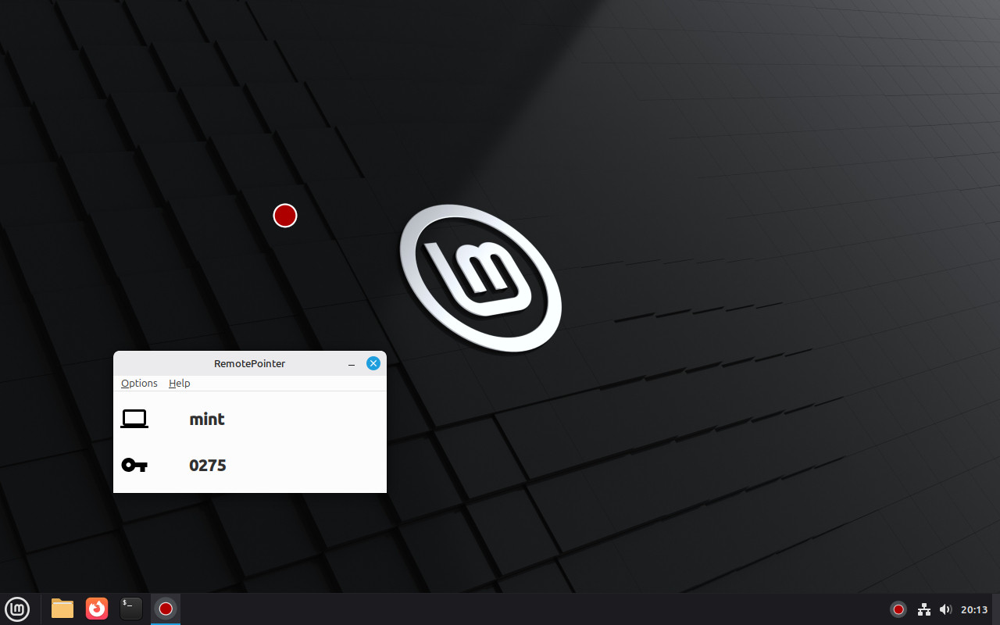
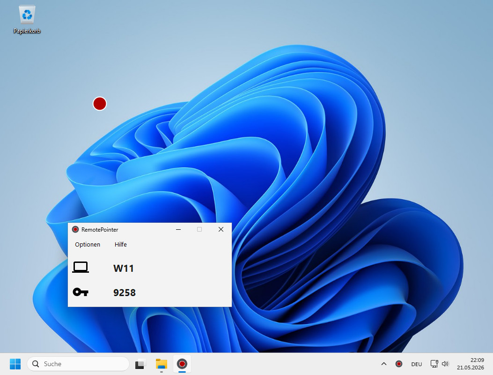

# RemotePointer-Server
Server application for the [RemotePointer Android App](https://github.com/schorschii/RemotePointer-Android). With RemotePointer you can use your smartphone to control your computer's mouse and keyboard and show a digital laser pointer.

The goal of this project is to provide an easy-to-use, platform independent, open source remote control application without dependencies to external servers and without tracking. If you like this project, please support the development by purchasing one of the in-app purchases in the Play Store or via Github sponsoring if you use the direct download.

